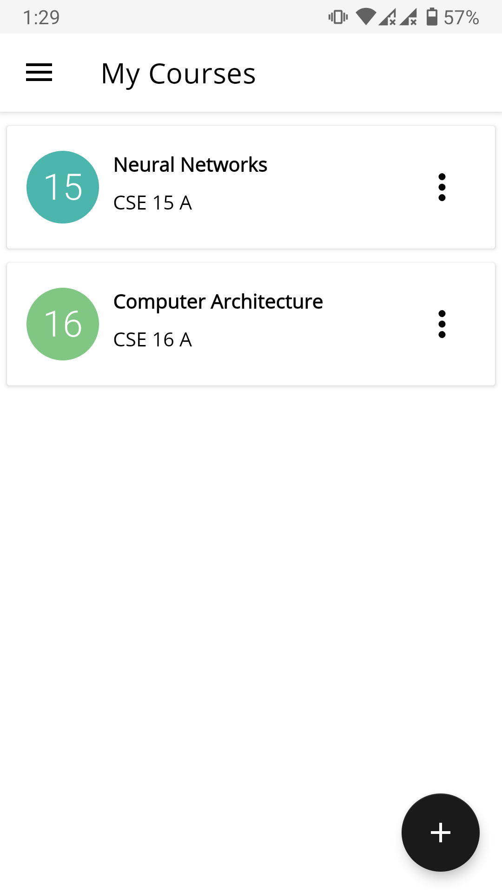
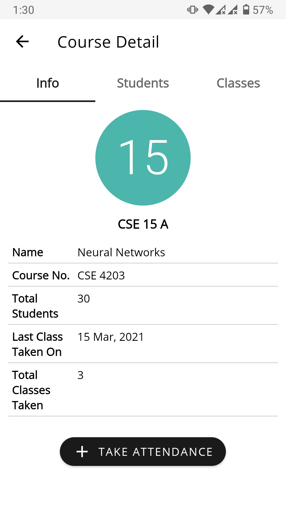
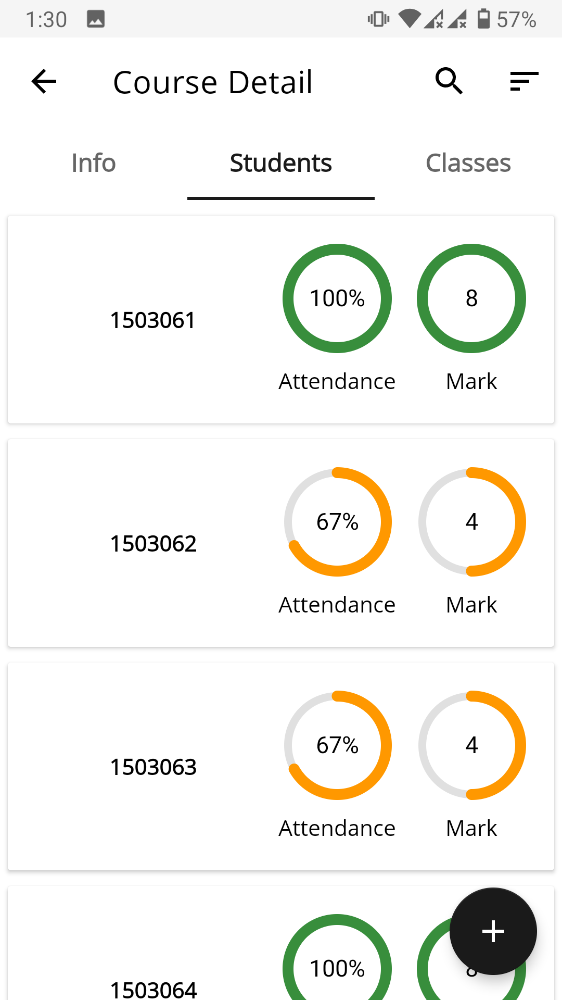
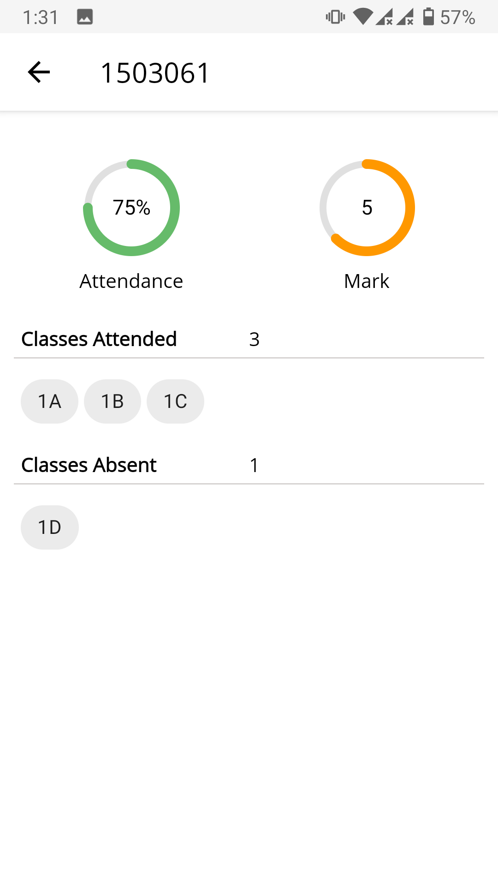

## Attendance Manager
 
__Attendance Manager__ is an Android app to manage class attendance. Easy to use and beautiful and minimalistic user-interface helps you focus on the task at hand. 

### Features
* Clean and minimalistic user-interface
* Manage multiple course attendance
* Auto-updated student attendance score
* Detailed data analysis per course, per student and class.
* Export attendance data as PDF document

### Download
Debug APK is available in the release section of this repository. 

__Software Requiment__: Android 5.0 (API level 21) or up.

### Screenshots
				